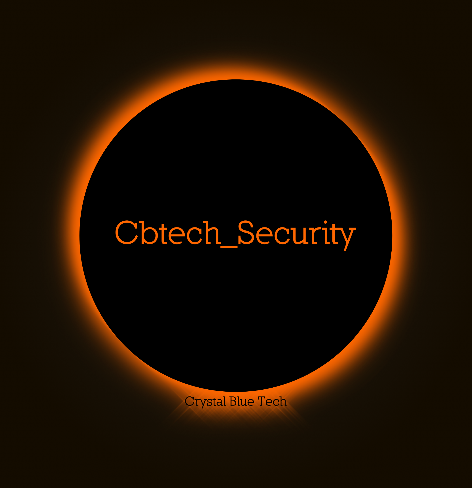

# software-dev-bootcamp

<a name="readme-top"></a>

<!--
HOW TO USE:
This is an example of how you may give instructions on setting up your project locally.

Modify this file to match your project and remove sections that don't apply.

REQUIRED SECTIONS:
- Table of Contents
- About the Project
  - Built With
  - Live Demo
- Getting Started
- Authors
- Future Features
- Contributing
- Show your support
- Acknowledgements
- License

OPTIONAL SECTIONS:
- FAQ

After you're finished please remove all the comments and instructions!
-->

<div align="center">
  <!-- You are encouraged to replace this logo with your own! Otherwise you can also remove it. -->
  
  <br/>

  <h3><b>Software Dev Bootcamp</b></h3>

</div>

<!-- TABLE OF CONTENTS -->

# 📗 Table of Contents

- [📖 About the Project](#about-project)
  - [🛠 Built With](#built-with)
    - [Tech Stack](#tech-stack)
    - [Key Features](#key-features)
  - [🚀 Live Demo](#live-demo)
- [💻 Getting Started](#getting-started)
  - [Setup](#setup)
  - [Prerequisites](#prerequisites)
  - [Install](#install)
  - [Usage](#usage)
  - [Run tests](#run-tests)
  - [Deployment](#triangular_flag_on_post-deployment)
- [👥 Authors](#authors)
- [🔭 Future Features](#future-features)
- [🤝 Contributing](#contributing)
- [⭐️ Show your support](#support)
- [🙏 Acknowledgements](#acknowledgements)
- [❓ FAQ (OPTIONAL)](#faq)
- [📝 License](#license)

<!-- PROJECT DESCRIPTION -->

# 📖 Software Dev Bootcamp<a name="about-project"></a>

> Describe your project in 1 or 2 sentences.

**This is a software i created that help in guiding people that want to learn coding in a professional way**

## 🛠 Built With <a name="built-with"></a>

1-HTML.
2-CSS.
3-LINTERS.

### Tech Stack <a name="tech-stack"></a>

> Describe the tech stack and include only the relevant sections that apply to your project.

<details>
  <summary>Client</summary>
  <ul>
    <li><a href="https://reactjs.org/">HTML</a></li>
    <li><a href="https://reactjs.org/">CSS</a></li>
  </ul>
</details>

<!-- Features -->

### Key Features <a name="key-features"></a>

> Describe between 1-3 key features of the application.
> Added index.html file.
> Added style.css file.

<p align="right">(<a href="#readme-top">back to top</a>)</p>

<!-- LIVE DEMO -->

## 🚀 Live Demo <a name="live-demo"></a>

> comming soon.

- [Live Demo Link](https://google.com)

<p align="right">(<a href="#readme-top">back to top</a>)</p>

<!-- GETTING STARTED -->

## 💻 Getting Started <a name="getting-started"></a>

> Describe how a new developer could make use of your project.

To get a local copy up and running, follow these steps.

### Prerequisites

1- Web browser
2- Code editor
3- Version Control System (git)

### Setup

Clone this repository to your desired folder:

Run this commands:

```sh
  cd my-folder
  git clone https://github.com/mohashyne/software-dev-bootcamp.git
```

-

### Install

Install this project with:

Run this command:

```sh
  cd my-project
  npm install
```

### Usage

To run the project, execute the following command:

launch index.html using live server or live preview

### Run tests

comming soon

### Deployment

You can deploy this project using:

comming soon

<p align="right">(<a href="#readme-top">back to top</a>)</p>

<!-- AUTHORS -->

## 👥 Authors <a name="authors"></a>

> Mention all of the collaborators of this project.

👤 **Muhammad Aminu Salihu**

- GitHub: [@mohashyne](https://github.com/mohashyne)
- Twitter: [@muhammadslyhu](https://twitter.com/muhammadslyhu)
- LinkedIn: [muhammad-salihu-27467a165](https://linkedin.com/in/muhammad-salihu-27467a165)
<!--

<p align="right">(<a href="#readme-top">back to top</a>)</p>

<!-- FUTURE FEATURES -->

## 🔭 Future Features <a name="future-features"></a>

> Describe 1 - 3 features you will add to the project.

- [ ] [Add Header]
- [ ] [Add Main]
- [ ] [Add footer]
- [ ] [Add styling]

<p align="right">(<a href="#readme-top">back to top</a>)</p>

<!-- CONTRIBUTING -->

## 🤝 Contributing <a name="contributing"></a>

Contributions, issues, and feature requests are welcome!

Feel free to check the [issues page](../../issues/).

<p align="right">(<a href="#readme-top">back to top</a>)</p>

<!-- SUPPORT -->

## ⭐️ Show your support <a name="support"></a>

> Write a message to encourage readers to support your project

If you like this project...

<p align="right">(<a href="#readme-top">back to top</a>)</p>

<!-- ACKNOWLEDGEMENTS -->

## 🙏 Acknowledgments <a name="acknowledgements"></a>

> I will like to thanks microverse and mosh hamedani for putting me through in this project.

I would like to thank...

<p align="right">(<a href="#readme-top">back to top</a>)</p>

<!-- LICENSE -->

## 📝 License <a name="license"></a>

This project is [MIT](./LICENSE) licensed.

_NOTE: we recommend using the [MIT license](https://choosealicense.com/licenses/mit/) - you can set it up quickly by [using templates available on GitHub](https://docs.github.com/en/communities/setting-up-your-project-for-healthy-contributions/adding-a-license-to-a-repository). You can also use [any other license](https://choosealicense.com/licenses/) if you wish._

<p align="right">(<a href="#readme-top">back to top</a>)</p>
